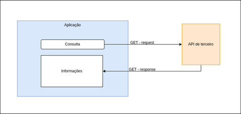
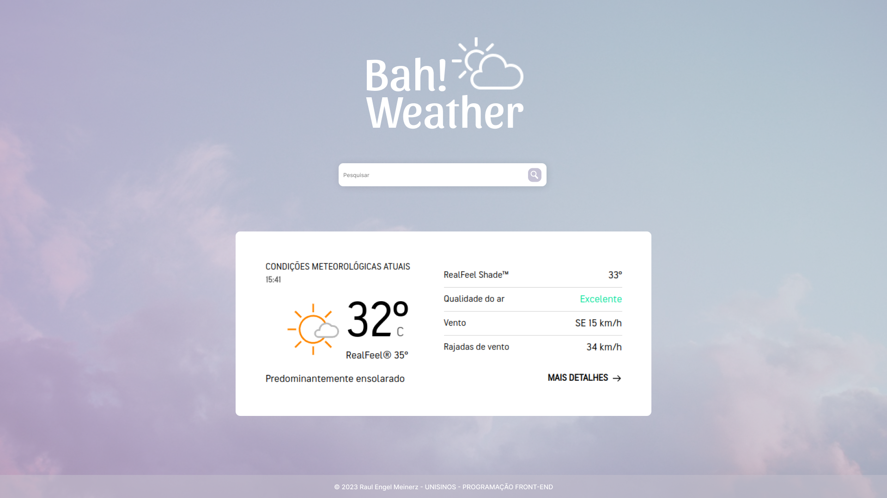

## UNISINOS - PROGRAMAÇÃO FRONT-END
Autor: Raul Engel Meinerz 
Curso: Sistemas para Internet

## Bah! Weather, consulta de clima
O projeto consiste em uma plataforma de consulta de clima desenvolvida em React, consumindo API externa.

O usuário informará os dados de entrada em um input, e ao efetuar a pesquisa o sistema enviará uma requisição para a API de tempo externa, que terá sua resposta exibida em tela na aplicação original.

https://www.accuweather.com/pt/br/brazil-weather

## Módulo 01: 
- Descrição do projeto
- Apresentação gráfica do protótipo